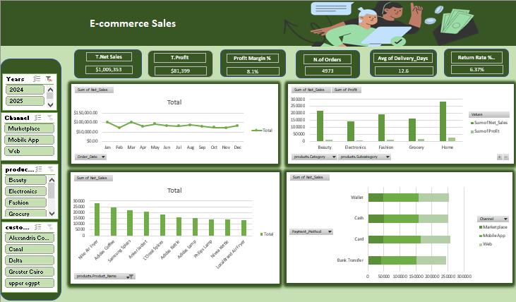

# E-Commerce Sales Analysis Dashboard

## Project Overview

This project presents an interactive E-Commerce Sales Dashboard built using Microsoft Excel. The dashboard provides a comprehensive view of sales performance, profitability, customer behavior, and operational metrics.

## Business Objectives

- Monitor overall sales performance.
- Track profitability and profit margins.
- Analyze product category performance.
- Identify top-selling products.
- Evaluate customer purchasing patterns.
- Compare sales across different channels.
- Monitor delivery performance and return rates.

## Tools & Techniques

- Microsoft Excel
- Pivot Tables
- Pivot Charts
- Slicers
- KPI Cards
- Dashboard Design

## Key Performance Indicators (KPIs)

- Total Net Sales: $1,005,353
- Total Profit: $81,399
- Profit Margin: 8.1%
- Number of Orders: 4,973
- Average Delivery Days: 12.6
- Return Rate: 6.37%

## Dashboard Features

- Interactive filtering by:
  - Year
  - Sales Channel
  - Product Category
  - Customer

- Visual analysis of:
  - Monthly Sales Trends
  - Sales vs Profit by Category
  - Top Selling Products
  - Sales by Payment Method
  - Channel Performance

## Skills Demonstrated

- Data Cleaning
- Data Analysis
- Data Visualization
- Dashboard Development
- KPI Design
- Business Analysis

## Conclusion

This dashboard helps businesses monitor performance, identify growth opportunities, and support data-driven decision-making through interactive visualizations and key business metrics.
